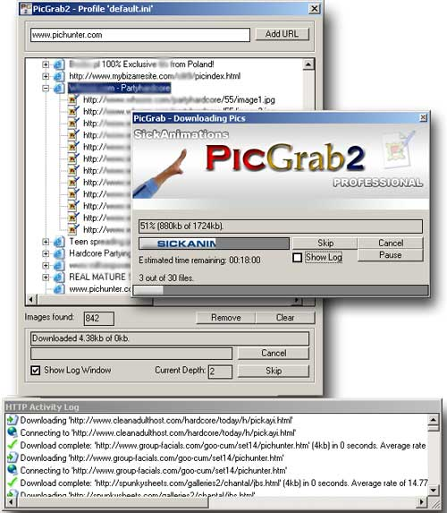



## PicGrab2\- Download all linked images or videos from a webpage  or gallery\! Also a Web Crawler/Spider

### Description

Ever wanted to download all of the images or videos on a Gallery, but there were far too many to be bothered? Is there a page for of RAR files you need to download? PicGrab2 will do that work for you!

This program uses MsWinsock.ocx and my HTTP Class Module, to get the source for a webpage, and scans the HTML code for links using my HTTP Module, and puts the links in the appropriate list. You can use this on a WebGallery portal, because PicGrab2 can visit all links to other webpages found in a webpage and get pictures from them as well. You can download all 'grabbed' pictures at once using the same unique (fully customizable) naming system used in the first version of PicGrab. Error trapping is top-notch.

The GUI is very neat and professional. Vote if you think this code is worthy of a vote - please don't complain too much about my lack of commenting.

You should leave feedback if you like it, i would truly appreciate it.
 
### More Info
 
URLs, Settings, Directories, etc.

Files

             |
---                |---
**Submitted On**   |2003-11-24 22:03:02
**By**             |[SickAnimations](https://github.com/Planet-Source-Code/PSCIndex/blob/master/ByAuthor/sickanimations.md)
**Level**          |Advanced
**User Rating**    |4.7 (47 globes from 10 users)
**Compatibility**  |VB 6\.0
**Category**       |[Internet/ HTML](https://github.com/Planet-Source-Code/PSCIndex/blob/master/ByCategory/internet-html__1-34.md)
**World**          |[Visual Basic](https://github.com/Planet-Source-Code/PSCIndex/blob/master/ByWorld/visual-basic.md)
**Archive File**   |[PicGrab2\-\_1997565302006\.zip](https://github.com/Planet-Source-Code/sickanimations-picgrab2-download-all-linked-images-or-videos-from-a-webpage-or-gallery-als__1-65503/archive/master.zip)

